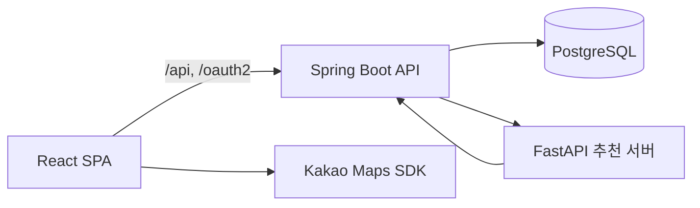

# OISO Frontend

경주 여행의 탐색부터 코스 추천, 여행 진행, 기록까지 한 흐름으로 연결하는 모바일 웹 애플리케이션입니다.

- 배포 URL: https://oiso-fe.vercel.app
- 기본 화면 폭: 모바일 우선, 데스크톱에서는 모바일 프레임으로 표시
- 지원 언어: 한국어, 영어

## 서비스 소개

OISO는 사용자의 여행 기간, 동행 유형, 선호 테마, 이동 수단과 저장한 장소를 바탕으로 경주 여행 코스를 추천합니다. 추천 결과는 사용자가 직접 편집하거나 공유할 수 있으며, 여행 중에는 장소별 이동 정보와 스탬프 미션을 확인하고 여행 후에는 메모와 스토리카드를 모아볼 수 있습니다.

## 주요 기능

### 여행지 탐색

- 관광지·음식점·숙소 목록 및 상세 정보 조회
- 키워드와 카테고리 기반 검색
- 카카오맵을 이용한 장소 위치와 이동 경로 표시
- 관심 장소 저장 및 저장 목록 관리
- 여행 기간과 겹치는 경주 축제 조회

### 코스 생성과 추천

- 여행 기간, 동행 유형, 테마, 이동 수단, 출발지 입력
- 저장한 장소와 여행 기간 중 진행되는 축제를 추천 입력에 반영
- 추천 결과를 실제 여행 코스로 저장
- 장소 추가·삭제·순서 변경 및 장소 간 이동 수단 편집
- 추천 코스와 사용자가 직접 만드는 코스 모두 지원

### 코스 진행과 공유

- 진행 중인 장소와 다음 장소 안내
- 이동 거리·시간과 외부 길찾기 연결
- 장소별 방문, QR, 스토리카드 스탬프 미션
- 코스 중단·완료 및 일차별 진행 상태 관리
- 공개 링크와 선택적 비밀번호를 이용한 코스 공유

### 마이페이지와 여행 기록

- 프로필과 선호 정보 관리
- 저장한 장소·스토리카드 조회
- 관광지·음식점·숙소별 개인 메모 작성
- 완료한 코스를 여행노트 형태로 조회
- 한국어·영어 전환

## 사용자 흐름


## 기술 스택

| 영역            | 기술                                           |
| --------------- | ---------------------------------------------- |
| UI              | React 19, TypeScript, Tailwind CSS 4, Radix UI |
| 빌드            | Vite 8                                         |
| 라우팅          | TanStack Router                                |
| 서버 상태       | TanStack Query                                 |
| 클라이언트 상태 | Zustand                                        |
| HTTP            | Axios                                          |
| 지도            | Kakao Maps SDK, react-kakao-maps-sdk           |
| 다국어          | i18next, react-i18next                         |
| 기타            | dnd-kit, QR Scanner, Sonner                    |
| 배포            | Vercel                                         |

## 시스템 구성



- 브라우저의 API 요청은 Axios 공통 클라이언트를 사용하며 쿠키를 포함합니다.
- 액세스 토큰이 만료되어 `401`이 발생하면 refresh API를 한 번만 호출한 후 원래 요청을 재시도합니다.
- 운영 환경에서는 Vercel rewrite가 `/api`, `/oauth2`, `/login/oauth2` 요청을 백엔드로 전달합니다.
- 개발 환경에서는 Vite proxy가 같은 역할을 하므로 CORS와 OAuth 쿠키 흐름을 운영 환경과 유사하게 확인할 수 있습니다.

## 프로젝트 구조

```text
src/
├─ api/          # 백엔드 API 호출 함수
├─ assets/       # 아이콘과 정적 이미지
├─ components/   # 도메인·공통 UI 컴포넌트
├─ constants/    # API 경로, query key 등 상수
├─ hooks/        # Query/Mutation 및 화면 로직 훅
├─ lib/          # Axios, i18n, query client 등 기반 설정
├─ locales/      # ko/en 번역 리소스
├─ mappers/      # API 모델과 화면 모델 변환
├─ routes/       # TanStack Router 파일 기반 라우트
├─ stores/       # Zustand 전역 상태
└─ types/        # 도메인 및 API 타입
scripts/
└─ sync-translations.ts  # Google Sheets 번역 리소스 동기화
```

## 주요 라우트

| 경로                         | 설명                                                 |
| ---------------------------- | ---------------------------------------------------- |
| `/`                          | 홈, 진행 중 코스, 추천 코스, 축제, 오늘의 스토리카드 |
| `/place`                     | 관광지·음식점·숙소 탐색                              |
| `/festival/:festivalId`      | 홈 축제 카드에서 진입하는 축제 상세                  |
| `/course`                    | 내 코스 목록                                         |
| `/course/recommend`          | AI 코스 추천 조건 입력                               |
| `/course/create`             | 코스 직접 생성                                       |
| `/course/:courseId`          | 코스 상세·편집·공유                                  |
| `/course/:courseId/progress` | 코스 진행                                            |
| `/my`                        | 프로필, 저장 목록, 메모, 여행노트                    |
| `/settings`                  | 언어와 계정 설정                                     |

## 로컬 실행

### 1. 의존성 설치

```bash
npm install
```

### 2. 환경변수 설정

루트에 `.env.local`을 만들고 필요한 값을 설정합니다. 실제 키는 저장소에 커밋하지 않습니다.

```dotenv
# 빈 값이면 상대 경로와 Vite proxy를 사용합니다.
VITE_API_BASE_URL=
VITE_RECOMMENDATION_API_BASE_URL=

# 생략하면 배포 백엔드를 사용합니다.
VITE_DEV_BACKEND_URL=https://oiso.duckdns.org

VITE_KAKAO_JS_KEY=your_javascript_key
VITE_KAKAO_REST_API_KEY=your_rest_api_key
```

### 3. 개발 서버 실행

```bash
npm run dev
```

개발 서버는 `http://localhost:5173`에서 실행되며 OAuth callback과 일치하도록 포트를 고정합니다.

## 로컬 카카오 로그인

개발 환경의 로그인 버튼은 `/oauth2/authorization/kakao-local`을 사용합니다. 백엔드가 사용하는 Kakao REST API 앱에 다음 Redirect URI가 등록되어 있어야 합니다.

```text
http://localhost:5173/login/oauth2/code/kakao-local
```

Vite가 OAuth와 API 요청을 백엔드로 프록시하고 개발 환경에 맞게 쿠키를 전달합니다. 기본 설정은 배포 백엔드를 바라보므로 로컬에서 수행한 저장·수정 작업이 운영 데이터에 반영될 수 있습니다.

## 명령어

| 명령어                 | 설명                             |
| ---------------------- | -------------------------------- |
| `npm run dev`          | 개발 서버 실행                   |
| `npm run build`        | 프로덕션 빌드 생성               |
| `npm run preview`      | 빌드 결과 로컬 확인              |
| `npm run lint`         | ESLint 검사                      |
| `npm run format`       | Prettier 적용                    |
| `npm run format:check` | 포맷 검사                        |
| `npm run i18n:sync`    | Google Sheets에서 번역 JSON 생성 |

번역 동기화에는 `GOOGLE_SHEET_ID`, `GOOGLE_SHEET_NAME`과 `scripts/oiso-i18n-service-account.json`이 별도로 필요합니다.

## 배포

`main` 브랜치가 Vercel 프로젝트와 연결되어 있습니다. `vercel.json`은 다음 요청을 처리합니다.

- `/api/*`, `/oauth2/*`, `/login/oauth2/*`: Spring Boot 백엔드로 프록시
- `/tour-image-proxy/*`: 한국관광공사 이미지 호스트로 프록시
- 그 외 경로: SPA 진입점인 `/index.html`로 rewrite

배포 전에는 아래 검사를 권장합니다.

```bash
npm run lint
npm run build
```
